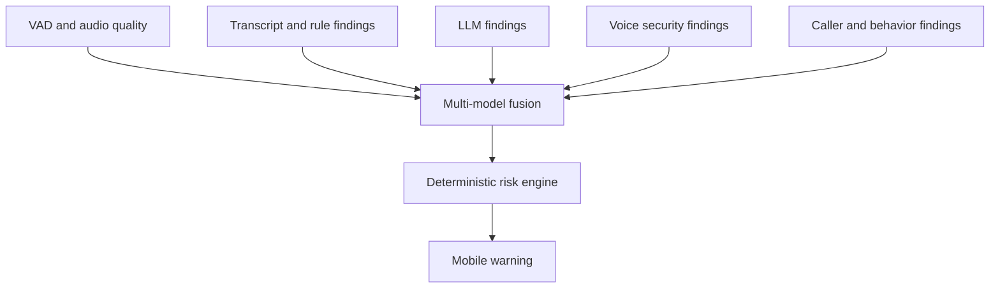

# Implementation Roadmap

This roadmap follows the **second 17-phase workflow** in the original “Cybersecurity Project Analysis” chat, as requested. Phase 1 (Development Environment), completed in the earlier “Set up Phase 1 environment” chat, and Phase 2 (Mobile ↔ Desktop Connection) are complete. The active planning phase is **Phase 3 — Audio Transport**. Phases 3–17 retain the intended sequence, with Phase 3 covering audio input, consent UX, and transport together.

| Phase | Work | Completion outcome | Status |
|---:|---|---|---|
| 1 | Development environment | Git repository, Flutter/Android Studio setup, Python environment, dependencies, and basic project structure prepared. | Complete |
| 2 | Mobile ↔ Desktop connection | Flutter client pairs to the Python desktop service through encrypted/authenticated local transport; dashboard shows and manages device/connection state. | Complete |
| 3 | Audio Transport | Microphone permission and consent, supported call-triggered capture, agreed audio format, bounded buffering, authenticated WebSocket streaming, desktop reception, playback/debugging, and latency measurement. | In progress |
| 4 | VAD | Silero installation; audio preprocessing; speech and silence detection; streaming VAD; CPU benchmark. | Backlog |
| 5 | Speech Recognition | faster-whisper Base; streaming transcription; timestamps; controlled transcript storage; accuracy testing. | Backlog |
| 6 | Rule Engine | Traceable rules for OTP, passwords, PINs, financial requests, remote access, authority impersonation, urgency, threats, secrecy, and suspicious URLs. | Backlog |
| 7 | Risk Engine | Feature schema, deterministic weights/calculation, confidence handling, and LOW/MEDIUM/HIGH/CRITICAL levels. | Backlog |
| 8 | LLM Analysis | Evaluate Qwen3-4B; prompt architecture; structured JSON; context analysis; explanation and summary; compare LLM findings with rules. | Backlog |
| 9 | Multi-model Fusion | Combine available VAD, STT, classifier/rule, LLM, voice, caller, and behavior signals; produce the final evidence-backed risk result. | Backlog |
| 10 | Mobile Warning | Deliver live score, threat level, reasons, and notification; offer a disconnect prompt and require user confirmation. | Backlog |
| 11 | Reports | User-reviewable summary, transcript, indicators, timeline, caller information, evidence references, SHA-256 hashes, and PDF/JSON export. | Backlog |
| 12 | Privacy/Censoring | PII detection; phone/name/address/financial redaction; validated audio muting and text redaction; user-controlled shareable report. | Backlog |
| 13 | Voice Security | Evaluate AASIST with ASVspoof and real/synthetic voice samples; report spoof/anomaly scores and false-positive performance without claiming certainty. | Backlog |
| 14 | Caller/Behavior Analysis | Caller database/reputation, call history/frequency/repeat calls, supported STIR/SHAKEN/verstat metadata where available, and conversation behavior. | Backlog |
| 15 | Controlled VoIP/SIP | Controlled SIP server/calls, RTP/SRTP, two-channel audio, desktop AI analysis, and controlled call routing. | Backlog |
| 16 | AI Honeypot | Isolated environment, constrained AI agent/security policy, evidence and indicator extraction, and incident creation. | Backlog |
| 17 | Full Integration | Demonstrate capture → stream → VAD → STT → analysis/fusion → risk → warning → incident → evidence → report across supported modes. | Backlog |

## Phase 2 scope and acceptance

Phase 2 includes the Flutter client, desktop service, and desktop browser dashboard. The desktop service receives mobile pairing requests and authenticated WebSocket connection/status messages. The dashboard is the desktop control surface for QR/manual pairing, approving or rejecting requests, viewing paired/connected/disconnected phones, enabling private-network access, and revoking a device.

The service stays loopback-only by default. Its dashboard and management endpoints remain local-only. The phone listener can bind to detected private IPv4 interfaces only after encrypted transport and device authentication are present and the user enables LAN access. The dashboard must show when a restart is required, prevent pairing until the listener applies the setting, and let the user choose which private address is embedded in a fresh QR code. No public Internet exposure or router port forwarding is part of the design.

Phase 2 is complete when:

- A phone can pair through a short-lived, single-use QR code or manual entry of the desktop address, pairing code, and TLS fingerprint.
- The desktop user approves the pairing; credentials are issued once, stored securely on mobile, and stored only as a salted hash on desktop.
- The phone establishes an authenticated WSS session with the pinned desktop certificate and displays **Connected** only after the service accepts the session.
- Desktop and phone show disconnect/recovery status; the desktop can revoke the phone and prevent reconnection until it pairs again.
- The demonstration shows **PHONE → CONNECTED → DESKTOP** without implying audio capture or analysis.

The user confirmed live QR pairing, desktop approval, an established phone-to-desktop connection, device revocation, and changing the selected Wi-Fi network. Follow-up live checks also confirmed desktop rejection, phone-side removal, dashboard revocation of an active connection, recovery after Wi-Fi interruption, and recovery after the desktop service was stopped and restarted. On desktop revocation, the dashboard shows **Revoked** and the phone reports that it is no longer paired. On phone-side removal, the phone clears its saved connection and the desktop shows **Disconnected**; the desktop can then revoke its retained device record. During Wi-Fi loss, the dashboard shows **Disconnected** and the phone reports **Disconnected / retrying** or **Connecting securely**, with a desktop-unavailable message. When Wi-Fi returns, the phone reconnects automatically and both views return to connected. When the desktop service is stopped, the phone and dashboard device status turn disconnected and the browser dashboard eventually becomes unavailable/offline. After the service is restarted, the existing pairing reconnects and both phone and dashboard return to connected. The Phase 2 connection acceptance outcome is complete. Audio capture and analysis remain out of scope.

## Phase 2 step-by-step status

| Step | Status | Evidence and remaining validation |
|---|---|---|
| Agree architecture, local-only default, and no-audio boundary | Complete | Confirmed before implementation. Audio capture/analysis and cellular-call access are not part of this phase. |
| Flutter Android client | Complete | QR scanner, manual entry, pairing states, connected/disconnected states, secure storage, reconnect loop, and forget-device action are implemented. Dart analysis passed and the Android debug APK built successfully. No microphone permission is requested. |
| Stable device ID and mobile credential storage | Complete | The installation ID persists separately from the approved device token; token and desktop pin use platform-protected storage. |
| Python desktop service and TLS | Complete | FastAPI dashboard listener is loopback-only. Phone HTTPS/WSS listener defaults to loopback and can be enabled on detected private IPv4 addresses after explicit user action. |
| QR pairing, desktop approval, and rejection | Live flow confirmed | User confirmed that approval connects the phone and dashboard, and rejection displays a desktop-rejection status on mobile. Manual fallback and expiry handling are implemented but were not separately reported as live-tested. |
| Authentication, certificate pinning, and desktop revocation | Live flow confirmed | TLS fingerprint pinning, per-device credentials, salted credential hashes, one-time token delivery, and revocation are implemented. User confirmed that revoking an active phone disconnects it, marks it **Revoked** on the dashboard, and shows the no-longer-paired status on mobile. |
| Phone-side removal and device-list state | Live flow confirmed | User confirmed that **Remove pairing from this phone** clears the phone's saved connection and returns it to the initial state; the dashboard retains the device as **Disconnected** with a **Revoke** action. Revoking the retained desktop record then disables that credential. |
| Authenticated WebSocket and connection recovery | Live recovery confirmed | WSS authentication and status keepalive are implemented; a local protocol smoke check passed. User confirmed initial connection, disconnection on revoke, automatic reconnection after Wi-Fi was restored, and disconnection on both sides when the desktop service was stopped. The browser dashboard showed offline while the service was stopped; after restart, the existing pairing reconnected and both sides showed connected. |
| Desktop dashboard and network selection | Live use confirmed | Pending approval, paired-device list, connection state, revocation, restart-required feedback, private-address selection, and fingerprint display are implemented. User confirmed network selection/change. |
| Failure guidance and setup documentation | Complete | Loopback QR codes are detected on mobile with corrective steps; dashboard blocks pairing until the listener setting is applied; manual fields identify their source. Setup, architecture, and roadmap docs were updated. |

### Optional follow-up verification and polish

- Try manual pairing once as a fallback-path check.
- The QR scanner’s visual targeting guide was noted as later UI polish; it does not block the verified QR connection flow.
- The verified client target is Android. An iOS target has not been scaffolded or validated in this repository; that remains platform follow-up work, not a Phase 2 Android acceptance blocker.

## Phase 3 — Audio Transport

### Approved scope expansion — 2026-10-09

Phase 3 supports three distinct sources: (1) the existing user-armed Cellular Protection path, which listens for Android call state and may receive silence or only local microphone sound because Android does not grant ordinary apps direct cellular-call audio; (2) a controlled Phone A ↔ Phone B in-app call using peer-to-peer WebRTC; and (3) a direct controlled WebRTC microphone stream from one phone to the Python desktop. The desktop also supports explicitly recorded voice messages for batch analysis and a Phone X/script diagnostic file replay.

For Phone A ↔ Phone B, both apps must be paired and online at the same desktop. Phone A requests a call through the existing authenticated `/api/v1/mobile/ws` control channel; the Python desktop assigns the `call_id`, fixes Phone A as `far` and Phone B as `near`, and presents an incoming consent prompt on Phone B. The mobile app lists paired phones with per-device call/end-call actions. Users do not choose roles. The desktop relays SDP and ICE only; live call media travels peer-to-peer over encrypted WebRTC. Only Phone B forwards audio to the dashboard: its local microphone and the decoded incoming Phone A track travel as two separate, authenticated VDA1 WebSocket streams keyed by device ID, server-issued call ID, and `near`/`far` track role. The desktop dashboard presents them as distinct rows grouped under one call. VDA1 remains unchanged: 656 bytes per frame, with a 16-byte `VDA1` header and 640 bytes of 16 kHz mono PCM16 data at 50 frames per second. Calls use the phone's private earpiece route by default; the app no longer forces speakerphone on both endpoints because of acoustic feedback/howling risk. The outgoing caller's Cellular Protection service is stopped when it initiates an in-app call to avoid a second capture source. Android's generic cellular off-hook state cannot distinguish an outgoing cellular call, so automatic suppression of cellular capture based on SIM-call direction is outside this implementation. The audio-routing change and call UI need physical-phone validation; the reported continuous high-pitched tone must be confirmed resolved before the controlled call flow is considered complete. Direct phone-to-dashboard WebRTC remains a separate one-phone stream mode and assigns `near` automatically. Neither controlled mode routes or captures arbitrary SIM calls. Initial WebRTC connectivity targets host ICE candidates on the trusted same LAN; STUN/TURN and cross-network deployment remain future work. The desktop accepts at most eight audio monitors, each with a 60-second RAM preview.

During a controlled app call, either participant may send a recorded voice message over an ordered WebRTC data channel. The receiving user explicitly accepts it; the transfer is size-limited and SHA-256 checked. The recipient can then upload the clip to the desktop for batch analysis, where normalized audio is stored locally for up to 24 hours and can be played or deleted from the dashboard. The Phone X diagnostic script can independently replay a local file as paced VDA1 frames at 50 fps. Voice messages are limited to 25 MB per upload and a combined 250 MB of unexpired desktop storage.

Phase 3 separates cellular protection from controlled app-call capture. The cellular path remains explicitly armed, does not capture while idle or ringing, and begins microphone capture only when Android reports `CALL_STATE_OFFHOOK`; off-hook can mean dialing, active, or held and does not prove the other party answered. This mode does not promise digital SIM-call audio. The controlled Phone A ↔ Phone B path uses in-app WebRTC and can provide both parties' digital audio to the desktop when Phone B consents and its two VDA1 streams are established from that target phone. The target's near/far mapping is issued by desktop signaling, not selected by users. Phase 4 begins VAD processing; Phase 3 adds no speech recognition, phishing analysis, or risk scoring.

### Proposed scope and architecture

- **Consent and permissions:** Explain the behavior before requesting microphone, call-state, and notification permissions. User Start arms a visibly running service; it does not open the microphone. Denial, revocation, service failure, and Stop have clear states.
- **Call detection and capture:** Android call-state monitoring detects ringing and off-hook telephony state. Capture begins only on `CALL_STATE_OFFHOOK` and stops at idle or when ringing is reported. Off-hook can include outgoing dialing, active, or held calls, so the app cannot assert that an outgoing call has been answered. This identifies a cellular-call state, not the caller or a direct digital call-audio source. Cellular Protection captures microphone input and may not receive both call sides. Keep the source model compatible with a future Controlled VoIP/SIP input.
- **Audio format:** Phase 3 uses mono PCM16, 16 kHz, in 20 ms (640-byte) frames. This initial transport contract can be revisited after target-device/VAD evaluation.
- **Bounded buffering and storage:** The phone has no accumulating VDA1 send queue; when OkHttp's send queue exceeds 64 KiB, it drops the newest frame and stops capture after 10 consecutive backpressured frames. WebSocket ingress accepts larger SDP controls while limiting messages to 256 KiB and four queued messages. The desktop retains up to 60 seconds (3,000 frames, about 1.92 MB per stream) in RAM for live preview. Explicit voice-message uploads are normalized and stored locally for 24 hours, subject to a 25 MB upload and 10-minute duration cap. Live WebRTC audio is not written to disk.
- **WSS streaming:** A separate `/api/v1/mobile/audio` WSS route reuses the paired device credential and SHA-256 certificate pin. Version 1 control messages define monitor/session start/stop; binary frames carry `VDA1`, a 32-bit big-endian sequence, a 64-bit big-endian monotonic capture timestamp, and 640 bytes of 16 kHz mono PCM16 little-endian payload (656 bytes total, one 20 ms frame). Each controlled-call near/far track uses its own authenticated audio socket and stream ID; the server authorizes the device, active call, and Phone B target role before accepting frames.
- **Desktop reception:** Validate device authorization, protocol, format, frame size, session, ordering, and monotonic timing. Display armed/receiving/disconnected/stopped state, level, drops/gaps, and arrival jitter in the loopback dashboard.
- **Playback/debugging:** Live playback is a user-triggered preview of the last 60 seconds from bounded RAM and is served only to the loopback dashboard. It clears on a new session or service exit. The dashboard can also play and delete received voice-message WAV files before expiry. The six-second generated 440 Hz tone remains a VDA1 WebSocket diagnostic. `scripts/replay_audio.py` decodes a local file to 16 kHz mono PCM16 and replays 656-byte frames at 50 frames/second. The existing tone path was verified by the user; the new Phone A ↔ Phone B call, separate near/far reception, voice-message data-channel transfer, and replay behavior require physical-device validation.
- **Latency measurement:** A two-second WSS request/response probe reports round-trip time; half is shown only as an approximate one-way estimate assuming a symmetric route. The desktop also reports observed frame-arrival jitter and sequence gaps. Phone/desktop monotonic clocks are not synchronized, so their raw subtraction is not used as one-way latency.

The Android microphone foreground service is started from the visible app only after the user chooses Arm and grants the required permissions. Its notification shows **Armed · microphone off** while waiting; it starts the microphone only after `TelephonyCallback` (or the legacy phone-state listener on older Android) reports `CALL_STATE_OFFHOOK`. Android defines that state as dialing, active, or on hold; the app cannot tell when an outgoing call is answered. Ringing and idle do not start capture. The paired **Connected to desktop** control channel is separate from the audio WSS channel: arming is complete only after the desktop replies `monitor.ready`, and the dashboard must then show **Armed · microphone off**. If that confirmation does not arrive, the phone remains microphone-off, retries, and displays the audio connection failure reason; an empty dashboard audio list means no monitor handshake has been confirmed. Capture stops on idle, ringing, explicit Stop, network loss, or capture failure; after network recovery, the service reconnects and resumes only if the user-armed session remains active and Android still reports off-hook. The service does not grant access to cellular call audio. Speakerphone input must be validated on the physical target phone and reported unsupported when unavailable. See [Android microphone foreground-service requirements](https://developer.android.com/develop/background-work/services/fgs/service-types#microphone), [background-start restrictions](https://developer.android.com/develop/background-work/services/fgs/restrictions-bg-start), [audio-input sharing rules](https://developer.android.com/media/platform/sharing-audio-input), and [Android call-state listener](https://developer.android.com/reference/android/telephony/TelephonyCallback.CallStateListener). The desktop dashboard remains local-only; enabling phone WSS on a trusted private network does not expose dashboard controls.

### Network interruption and protection state — 2026-10-08

The user verified Wi-Fi loss while paired and protection was armed. The phone displayed **Desktop unavailable · microphone off**, showed the audio connection failure, and explained that protection remained armed. The user could turn protection off while disconnected. When Wi-Fi/desktop connectivity returned, the audio monitor reconnected and armed protection resumed because the user had left it turned on. Pairing also recovered. This confirms the intended behavior: microphone transmission stops during the interruption, and streaming resumes only after desktop monitor confirmation if the user-armed session remains active and Android still reports off-hook. The mobile UI offers **Turn off call protection** and explains this auto-resume condition. Mobile and desktop WebSocket keepalive intervals were shortened to 5 seconds (with a 5-second server ping timeout) to help detect lost Wi-Fi sooner; exact detection timing has not yet been measured.

### Live transport observation — 2026-10-08

During the user's active cellular call, four read-only dashboard API samples over approximately six seconds showed the frame count increasing from 46,764 to 47,070 (about 50 frames/second), with exactly 640 payload bytes per frame, no sequence gaps, and no dropped frames. Round-trip probes ranged from about 8.7 to 24.8 ms. In all four samples the most recently received 20 ms frame had RMS 0 and peak 0, meaning every PCM sample in each sampled frame was zero. This verifies authenticated WSS delivery and frame cadence, but **does not verify that usable microphone audio or either call participant's speech reached the desktop**. The dashboard now says “Receiving audio frames” and separately reports whether the latest delivered frame contains any non-zero samples. A sustained silent input during a cellular call can reflect Android/device call-audio routing or microphone availability; confirm ordinary microphone input and, separately, a consensual speakerphone test before describing cellular call audio as captured. No audio preview was fetched or played for this observation.

The user then repeated the live check with speakerphone enabled. Five read-only samples over approximately eight seconds showed frames increasing from 7,589 to 7,993 (about 50 frames/second), with 640 bytes per frame, no gaps/drops, RTT about 10.6–25.0 ms, and jitter about 19.5–22.7 ms. Each sampled latest frame again had RMS 0 and peak 0. This confirms the transport stayed healthy but speakerphone did not produce detectable microphone samples in this run. The exact cause remains device/OS audio routing or microphone-input behavior; this ordinary app cannot claim direct cellular-call audio. Android documents that a voice call has priority over ordinary-app audio capture and restricts call capture to specific privileged/accessibility cases ([Android audio-input sharing](https://developer.android.com/media/platform/sharing-audio-input)). Keep Phase 3 marked **In progress** for source validation; do not change transport framing based on this result.

During the user's latest live cellular-call test, five read-only dashboard snapshots two seconds apart showed the audio session remained **Receiving** and frame count increased from 7,397 to 7,803 over eight seconds (about 50.8 frames/second). The payload format remained 16 kHz mono PCM16 with 640-byte payloads. At each of the five sample points, the latest delivered frame had RMS 0 and peak 0; the snapshots do not establish whether every intervening frame was silent. All samples showed zero sequence gaps and zero dropped frames. RTT ranged from 10.09 to 48.11 ms (estimated one-way 5.05–24.05 ms), and reported jitter ranged from 19.18 to 24.83 ms. This again points away from WebSocket delivery or frame loss and leaves usable microphone/call audio unconfirmed. The phone's speakerphone state was not independently reconfirmed for this run.

### Synthetic tone and desktop playback verification — 2026-10-08

The user ran the generated 440 Hz diagnostic tone from the paired phone. The dashboard received the audio, and **Play recent 5 seconds** produced an audible ringing tone. This verifies the diagnostic source, authenticated WebSocket delivery, desktop buffering, preview generation, and dashboard playback path with a known non-silent source. It does not prove that `AudioRecord` receives usable microphone audio during cellular calls. The cellular-call microphone source remains the outstanding physical-device validation item.

### Consent, permission-denial, and Stop verification — 2026-10-08

The user reports that denying a required call-protection permission leaves capture off; attempting to arm again requests the permission, granting it permits arming, and denying it leaves the screen at **Call capture is off**. Stopping armed protection removes its ongoing notification. The user separately confirmed that denying camera permission does not prevent armed protection. This matches the Android arm gate in `MainActivity`: microphone (`RECORD_AUDIO`), phone state (`READ_PHONE_STATE`), and notifications (`POST_NOTIFICATIONS` on Android 13+) are required; camera permission is only used for QR scanning and is not part of the call-protection arm gate.

The user verified on-device that the foreground-service notification reappears after being swiped away, protection remains active, the notification Stop action turns protection off, and the notification is dismissed when protection is turned off. `setOngoing(true)` cannot make it stationary: Android 13+ allows dismissal, and Android 14 explicitly changed `FLAG_ONGOING_EVENT` behavior to allow it ([Android 13 behavior change](https://developer.android.com/about/versions/13/behavior-changes-all), [Android 14 behavior change](https://developer.android.com/about/versions/14/behavior-changes-all)). The internal dismissal receiver reposts the active notification after a short delay, preserving the Stop action. Android still controls whether a notification can be pinned, so this implements reappearance rather than guaranteed non-dismissibility.

### Proposed implementation sequence

1. Implement the consent flow and visible Android foreground service in armed/microphone-off state, with a notification stop action.
2. Add least-privilege microphone and call-state permissions, Android call-state monitoring, and automatic capture only while the user-armed session sees `CALL_STATE_OFFHOOK`.
3. Implement fixed-format audio capture and bounded backpressure behavior; stop immediately on call end, user stop, loss of desktop connection, or capture failure.
4. Define and implement the versioned WSS monitor/session protocol and binary frame contract over the existing pinned device identity.
5. Implement the direct phone-to-desktop WebRTC mode and the Phone A ↔ Phone B controlled call. Use the paired control WSS for desktop-authorized session IDs, near/far roles, SDP, and ICE; relay call media peer-to-peer; tap Phone B's local and received WebRTC audio tracks into separate authenticated VDA1 streams. Add consented data-channel voice-message transfer, desktop temporary storage, the existing 60-second preview, and paced 50 fps VDA1 file replay.
6. Build the mobile APK and desktop service; validate same-LAN calls between two paired phones, desktop-issued call IDs and roles, separate audible near/far dashboard playback, incoming-call consent/rejection/hangup, voice-message transfer and integrity verification, upload/storage/delete/expiry, direct desktop stream, and paced file replay. Continue reporting cellular microphone availability separately from controlled app-call audio.
7. Update setup, architecture, privacy, and roadmap documentation with implementation decisions and observed device behavior.

### Proposed acceptance criteria

- The app explains the purpose and requests microphone permission only after a user-initiated start action; denial does not start capture.
- While active, the app has an unmistakable status and immediate stop control. Moving the app UI to the background does not stop the service. Android may let the user dismiss its foreground-service notification; the app attempts to repost it while protection remains active. The notification Stop action or in-app Stop control ends protection. User stop, permission revocation, service termination, and capture errors end or clearly mark the session.
- User Start arms monitoring only; the microphone remains off while Android reports idle or ringing. It begins on `CALL_STATE_OFFHOOK` (which may include outgoing dialing, active, or held calls), not on a claim that the remote party answered. The service begins while the app is visible and posts a foreground notification with Stop. If the user dismisses the notification on a version that allows it, the app attempts to repost it without stopping protection.
- Only the agreed supported source is captured. Cellular-mode language does not promise general cellular call access or two-sided audio.
- A paired phone streams correctly framed, versioned audio over authenticated WSS, and the desktop validates and receives it into a bounded transient queue.
- A user can start/stop a direct WebRTC microphone stream after consent; authenticated WSS carries signaling only. aiortc/PyAV reception groups independent streams by device ID, call ID, and role.
- Two paired phones can establish a consented in-app WebRTC call through desktop-authorized signaling, with Phone A=`far` and Phone B=`near`. Phone B streams local near audio and received far audio separately through authenticated VDA1 WSS sockets; the dashboard groups both under the server-issued call ID.
- The mobile call screen shows all paired phones with one-tap call/end-call icons and no manual role selector. Calls default to the earpiece route; physical-device validation must confirm normal two-way audio and no continuous high-pitched feedback before acceptance.
- Either call participant can explicitly send a recorded clip through a consented WebRTC data channel; recipient integrity-checks it and can forward it to the dashboard's temporary batch-analysis storage.
- A user can explicitly record and send a voice message; the desktop stores a normalized local WAV with 24-hour expiry and dashboard play/delete controls.
- A local audio file can be replayed over authenticated WSS as 656-byte VDA1 frames paced at 50 frames per second.
- The desktop dashboard shows armed, receiving, stopped, and error/disconnected states. Audio is available for playback only through an explicit local user action and remains in bounded volatile memory.
- Live streams are never written to disk and use a 60-second RAM preview. User-submitted voice messages are temporarily stored with explicit expiry and delete controls. Queue and upload limits are documented.
- Desktop-observed arrival jitter, sequence gaps, and any latency estimate use a stated method and do not claim unsupported cross-clock precision.
- The received stream is ready for Phase 4 preprocessing/VAD; Phase 3 performs no VAD, speech recognition, model analysis, or risk scoring.
- Physical-device validation checks background continuation and the ongoing notification, and separately checks whether supported microphone input is available during a cellular speakerphone call. The app reports capture unavailable rather than implying cellular call audio is being received.

### Handoff to later phases

Phase 4 consumes validated desktop audio frames for preprocessing, resampling as needed, speech/silence detection, streaming VAD, and CPU benchmarking. Phase 5 transcribes speech segments. Phase 6 extracts traceable rule findings; Phase 7 establishes deterministic baseline risk; Phase 8 adds structured LLM analysis; Phase 9 fuses available signals. Phase 10 sends actionable warnings to the phone, Phase 11 creates reports, and Phase 12 applies privacy/censoring controls to saved or shared material. Phases 13–14 add voice security and caller/behavior signals to the extensible fusion schema. Phase 15 adds the controlled VoIP/SIP source and call path; Phase 16 adds an isolated, policy-constrained honeypot; Phase 17 evaluates the complete integrated system. Privacy, consent, bounded processing, and source limitations apply from the start rather than being deferred to Phase 12.

## Phases 4–17 scope notes

- **Phase 4 — VAD:** Install and evaluate Silero; preprocess audio; detect speech and silence in streaming operation; benchmark CPU use and latency.
- **Phase 5 — Speech Recognition:** Integrate faster-whisper Base first; emit streaming, timestamped transcript segments; define transcript retention before storing anything; test accuracy on representative audio.
- **Phase 6 — Rule Engine:** Detect the listed credential, financial, remote-access, authority, urgency, threat, secrecy, and URL indicators with traceable evidence spans and test cases.
- **Phase 7 — Risk Engine:** Define a versioned feature schema, deterministic weights and calculation, confidence/quality handling, and configurable LOW/MEDIUM/HIGH/CRITICAL bands. Treat scores as risk estimates, not calibrated probabilities until evaluated.
- **Phase 8 — LLM Analysis:** Evaluate Qwen3-4B on the available hardware; require schema-validated JSON; test prompt boundaries, contextual reasoning, explanations, summaries, and comparisons against rule-only findings. The LLM does not make safety-critical decisions.
- **Phase 9 — Multi-model Fusion:** Define how rule, LLM, VAD/STT quality, and later voice/caller/behavior findings enter the fusion schema. The deterministic risk engine remains the final scoring authority; Phases 13–14 add signals and require regression evaluation of fusion.
- **Phase 10 — Mobile Warning:** Show a live level, score, reasons, and notification. A high risk can prompt disconnection, but the user confirms the action; the app does not silently terminate a call.
- **Phase 11 — Reports:** Assemble a reviewable summary, transcript, indicators, timeline, caller context, evidence references, and SHA-256 hashes; export PDF and JSON with provenance.
- **Phase 12 — Privacy/Censoring:** Implement PII detection and user-selected phone, name, address, and financial redaction; validate text redaction and audio muting; generate shareable copies while preserving access controls for originals.
- **Phase 13 — Voice Security:** Evaluate AASIST using ASVspoof plus held-out real and synthetic samples; measure false positives and domain shift; report an anomaly score, never proof of caller identity or synthetic origin.
- **Phase 14 — Caller/Behavior Analysis:** Add a local caller/reputation store and call-history/frequency signals; use STIR/SHAKEN/verstat only when supplied by a supported platform/provider; evaluate conversation behavior with evidence and uncertainty.
- **Phase 15 — Controlled VoIP/SIP:** Build the controlled call path and SIP/RTP/SRTP integration, expose separate user/caller channels to analysis, and support only the routing actions allowed by the controlled environment. Keep the Phase 3 audio contract source/channel-aware so this later source does not require a redesign.
- **Phase 16 — AI Honeypot:** Run only in an isolated controlled environment with explicit security policy and no access to user secrets or unrestricted network actions; extract indicators/evidence and create an incident record.
- **Phase 17 — Full Integration:** Demonstrate the complete supported call-to-report flow, verify both operating modes within their platform constraints, and evaluate accuracy, latency, CPU/GPU/memory, reliability, privacy, and failure handling.

Phase 9's intended signal flow is:



The Phase 17 integration path is:

```text
CALL → CAPTURE → STREAM → VAD → STT → RULE / LLM / VOICE / CALLER-BEHAVIOR
     → FUSION → RISK → WARNING → USER ACTION → INCIDENT → EVIDENCE → REPORT
```

## Execution rules

- Discuss and agree on a phase before implementation. Phases 1–2 are complete; Phase 3 implementation is in progress under the user-approved scope.
- Work on one phase at a time and carry unresolved decisions forward explicitly.
- Keep cellular protection and controlled VoIP/SIP boundaries separate. The controlled VoIP path is the full-audio demonstration path; cellular mode must remain honest about operating-system restrictions.
- Do not freeze model thresholds based on illustrative weights. Record data, measurements, and validation before tuning.
- Preserve privacy defaults: explicit consent, local processing, transient buffering, user-controlled incident retention, and user authorization before external sharing.
- Track platform-specific support separately; a shared Flutter UI does not imply identical Android/iOS call or audio capabilities.
- Do not store secrets, private recordings, or generated model weights in Git. Review and commit changes only at user-directed checkpoints.
